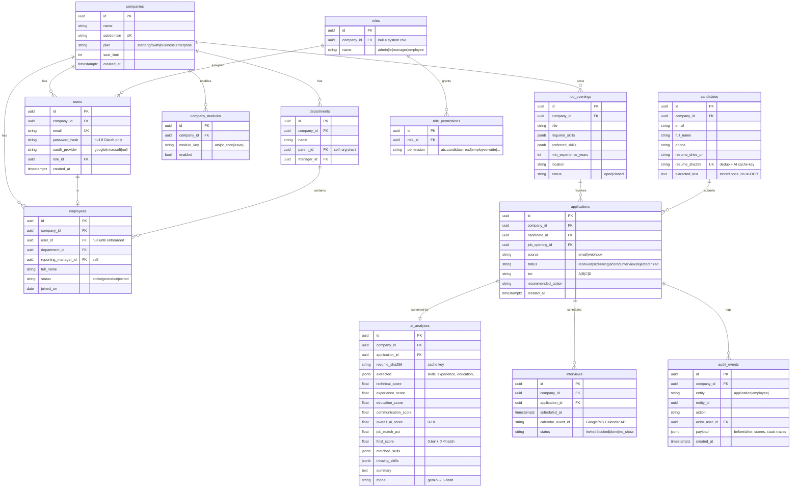

# Lamoon HR — Phase 1 Architecture

AI-first HRMS + ATS for Indian SMEs (20–500 employees). One deployment, many
companies. AI recruitment is the moat; everything else is commodity CRUD we
build lean or defer.

**Stack (locked):** Next.js 15 / React 19 / TS / Tailwind / shadcn on the front;
FastAPI / SQLAlchemy / Postgres on the back; Redis + Celery for async; Gemini
2.5 Flash + `text-embedding-004` for AI. **All dependencies MIT/Apache-2.0.**
No GPL/AGPL/fair-code code is embedded (ERPNext is read-as-reference only).

---

## 1. Product architecture — modular monolith

One FastAPI app, one Postgres DB, module boundaries enforced by Python packages
— **not** microservices. Rationale: microservices buy independent scaling and
deploys you don't need at 20–500-employee tenants, and cost you a service mesh,
N databases, and distributed debugging. The spec's "independently deployable
later" is satisfied by clean module boundaries now; split out a module the day
it actually needs its own scale (realistically only the AI workers ever will).

```
                          ┌─────────────────────┐
   Next.js (Vercel/edge)  │   API Gateway layer  │  FastAPI routers
   ─────────────────────► │  auth · tenant · RBAC │  (one deployable)
                          └──────────┬───────────┘
                                     │
      ┌──────────────┬───────────────┼───────────────┬──────────────┐
      ▼              ▼               ▼                ▼              ▼
   ATS + AI      HR Core         Auth/RBAC        Notifications   Audit
  (flagship)   Employee dir     Users/Roles       Email/SMTP     Activity log
      │         Company/Dept                                          
      ▼                                                               
  Celery workers ──► Redis ──► Postgres ──► Google Drive (resume archive)
  (Gemini, email, OCR — the only horizontally-scaled tier)
```

**V1 modules (build now):** Auth/RBAC, Tenant/Company, HR Core (employee
directory + departments), ATS + AI screening, Notifications (email), Audit.

**Deferred (Phase 2+, same monolith, same patterns):** Attendance, Leave,
Timesheets, Payroll, Compliance, Assets, PMS, LMS, Engagement, AI Assistant,
Analytics. Each is a new package under `modules/`, gated by a feature flag.

**Module enablement:** a `company_modules` table (company_id, module_key,
enabled). A FastAPI dependency rejects requests to disabled modules with 402.
Customers pay for what they turn on — no separate builds.

---

## 2. Multi-tenant strategy — shared DB, shared schema, `company_id` row-scoping

Three options considered:

| Model | Isolation | Cost at 100 tenants | Verdict |
|---|---|---|---|
| DB per tenant | Highest | 100 Postgres DBs to run/migrate/back up | Too costly for SMEs |
| Schema per tenant | High | 100 schemas, migration fan-out | Overkill |
| **Shared schema + `company_id`** | Row-level | **One DB, one migration** | ✅ **Chosen** |

Enforcement (defense in depth — never rely on the app remembering a WHERE clause):

1. **JWT carries `company_id`.** Set at login, never client-supplied.
2. **Postgres Row-Level Security (RLS).** Every tenant table has an RLS policy
   `USING (company_id = current_setting('app.company_id')::uuid)`. A middleware
   runs `SET app.company_id = <jwt.company_id>` per request/transaction. Even a
   buggy query physically cannot read another tenant's rows.
3. **SQLAlchemy base class** injects `company_id` on insert and a default filter
   on read — convenience layer; RLS is the real guard.

RLS is the one non-negotiable. It's ~15 lines of migration and it's the
difference between a query bug and a cross-tenant data breach.

Row conventions — every tenant table carries: `id` (uuid), `company_id`,
`created_at`, `updated_at`, `created_by`, `deleted_at` (soft delete).

---

## 3. ERD — V1 tables only

Later modules follow the same shape (uuid PK, `company_id` FK, audit columns);
not spec'd here because they're unvalidated. `companies` is the tenant root and
is the only table without a `company_id` (it *is* the company).



Notes:
- **`candidates.resume_sha256` is the cost lever.** Unique per company; on
  re-submit, dedup instead of re-uploading. `ai_analyses.resume_sha256` caches
  the Gemini result — same resume against same JD is never re-analyzed.
- **`extracted_text` stored once** → OCR/parse runs a single time per resume.
- `ai_analyses.extracted` is `jsonb`, not 20 columns — the AI schema will churn;
  don't migrate the table every prompt tweak.

---

## 4. Folder structure

```
hrms/                          # monorepo root (this repo)
├─ apps/
│  ├─ web/                     # Next.js 15 (App Router)
│  │  ├─ app/(auth)/           # login, oauth callbacks
│  │  ├─ app/(dash)/           # tenant-scoped shell, command palette
│  │  │  ├─ ats/               # flagship: pipeline board, candidate view
│  │  │  └─ people/            # employee directory
│  │  ├─ components/ui/        # shadcn
│  │  ├─ lib/api.ts            # typed client (React Query)
│  │  └─ lib/store.ts          # Zustand (UI state only)
│  └─ api/                     # FastAPI
│     ├─ main.py               # app factory, router registration
│     ├─ core/
│     │  ├─ config.py          # settings (env)
│     │  ├─ db.py              # SQLAlchemy session, RLS set-var middleware
│     │  ├─ security.py        # JWT, password hash, OAuth
│     │  ├─ tenant.py          # company_id dependency + module-flag guard
│     │  └─ rbac.py            # require_permission() dependency
│     ├─ modules/
│     │  ├─ auth/              # routes, schemas, service, models
│     │  ├─ tenant/            # companies, company_modules
│     │  ├─ hr_core/           # employees, departments
│     │  ├─ ats/               # jobs, candidates, applications, intake
│     │  │  ├─ ai.py           # Gemini screening + job match + scoring
│     │  │  ├─ intake.py       # email + webhook front doors
│     │  │  └─ pipeline.py     # Celery task chain (the "workflow")
│     │  ├─ notifications/     # email (SMTP/Graph/Gmail)
│     │  └─ audit/
│     ├─ workers/              # celery app + scheduled beat jobs
│     └─ migrations/           # alembic
├─ docker-compose.yml          # postgres, redis, api, worker, web
├─ ARCHITECTURE.md             # this file
└─ .env.example
```

One module = one package with `routes / schemas / service / models`. Boundaries
are import rules: a module imports `core/` and its own package, nothing sideways.
That's what makes "extract to a service later" a move, not a rewrite.

---

## 5. API design — V1 surface

REST, JSON, OpenAPI auto-generated by FastAPI (`/docs` Swagger, `/openapi.json`
→ Postman import). All routes under `/api/v1`, tenant-scoped via JWT.

```
# Auth
POST   /auth/login                 email+password → {access, refresh}
POST   /auth/refresh
GET    /auth/oauth/{google|microsoft}/start
GET    /auth/oauth/{provider}/callback
GET    /auth/me

# Tenant / admin
GET    /companies/me
PATCH  /companies/me               settings
GET    /companies/me/modules       enabled modules
PATCH  /companies/me/modules       toggle (billing-gated)

# HR Core
GET    /departments   POST /departments   PATCH /departments/{id}
GET    /employees?department_id&status    POST /employees
GET    /employees/{id}   PATCH /employees/{id}   DELETE /employees/{id}  (soft)

# ATS — jobs
GET    /jobs   POST /jobs   PATCH /jobs/{id}   POST /jobs/{id}/close

# ATS — intake (the two front doors)
POST   /apply                      webhook: form + resume (multipart) → 202
# email intake is a Celery beat job polling hr@ inbox, not an endpoint

# ATS — pipeline
GET    /applications?job_id&tier&status&q     searchable
GET    /applications/{id}          full audit + scores + AI summary
POST   /applications/{id}/screen   force re-run AI (cache-bypass, on demand)
POST   /applications/{id}/advance  → interview
POST   /applications/{id}/reject
POST   /applications/{id}/interview  create Calendar event + candidate link

# Audit
GET    /audit?entity&entity_id
```

Conventions: cursor pagination, `?q=` full-text on candidates, 402 for
disabled modules, 403 from RBAC, idempotency key on `POST /apply` (dedup).

---

## 6. RBAC — Postgres tables + FastAPI dependency (no Keycloak in V1)

Four seed roles per company: **admin, hr, manager, employee**. Permissions are
flat strings (`resource.action`, e.g. `ats.candidate.read`,
`employee.write`, `payroll.read`). `role_permissions` maps them.

```python
# core/rbac.py — the entire enforcement surface
def require(permission: str):
    def dep(user = Depends(current_user)):
        if permission not in user.permissions:   # loaded from role at login
            raise HTTPException(403)
        return user
    return dep

# usage
@router.get("/employees", dependencies=[Depends(require("employee.read"))])
```

Why not Keycloak now: it's a whole Java service + realm config to run for what
is one table and one dependency at SME scale. **Keycloak enters at V4** when
enterprise SSO/SAML is a paying requirement.

**The auth seam that makes that swap safe.** Business logic never sees a
password, a token library, or an IdP. It sees an authenticated `User`. One
interface stands between them:

```python
# core/auth/provider.py
class IdentityProvider(Protocol):
    async def authenticate(self, credentials) -> Principal: ...   # verify, return identity
    async def issue_session(self, principal) -> TokenPair: ...    # access + refresh
    async def verify_session(self, token) -> Principal: ...       # for the current_user dep

# V1 implementation: LocalIdentityProvider (password + Google/MS OAuth)
# V4 implementation: KeycloakProvider / SamlProvider — same Protocol
```

`current_user` depends only on `IdentityProvider.verify_session`; routes and
services depend only on `current_user`. Swapping to Keycloak is registering a
different implementation in one place — **zero changes to any module**. The
`users` table keeps `oauth_provider` / nullable `password_hash` so an external
IdP maps onto existing rows instead of a migration.

Row-level scoping (a manager sees only their reports) rides on RLS + a query
filter, not a permission string — keep the two concerns separate.

---

## 7. AI cost model — the #1 requirement

Every lever that keeps AI spend near zero:

| Lever | Mechanism | Effect |
|---|---|---|
| **Screen once per resume** | `ai_analyses` keyed by `resume_sha256` | Re-submits / re-opens = **0 API calls** |
| **No re-OCR** | `candidates.extracted_text` stored | Parse runs once per resume, ever |
| **Cheap model default** | Gemini 2.5 **Flash** for all screening | ~20× cheaper than Pro |
| **Escalate on demand only** | Pro reserved for explicit "deep review" | Human triggers cost, never the pipeline |
| **One call per resume** | Extract + score + match in a single structured prompt | Not 3 round-trips |
| **Batch embeddings** | `text-embedding-004` batched for JD match | Embeddings ≪ generation cost |
| **Truncate input** | Cap at 10 pages / N tokens before send | Bounded prompt size |
| **Queue, don't spike** | Celery serializes calls | Predictable spend, respects rate limits |

Rough unit economics: one resume ≈ one Flash call (~a few K tokens in, ~1K out)
≈ well under ₹1. A 100-resume drive costs cents, and any duplicate in it is
free. This is what lets AI screening be a standard feature, not a metered
premium — with an **AI-credits** add-on only for the on-demand Pro escalations.

**Pricing (per-employee/month, your tiers):** Starter (≤25) · Growth (26–100)
· Business (101–500) · Enterprise (custom). AI screening included; Pro deep-dives
draw from an AI-credit balance. Module flags = upsell path.

---

## What this doc deliberately leaves out
- Detailed ERD/API for Phase 2+ modules — unvalidated, same patterns apply.
- Workflow *engine* — V1 ships the ATS pipeline concretely (`ats/pipeline.py`);
  the engine gets extracted when a second process reuses it.
- S3, Kubernetes, Keycloak — Drive/Docker/Postgres-RBAC now; swap at the phase
  that needs them, each isolated behind one module.

**Next step on approval:** scaffold this as a runnable skeleton (auth +
multi-tenant + employee directory + ATS resume→screen slice).
